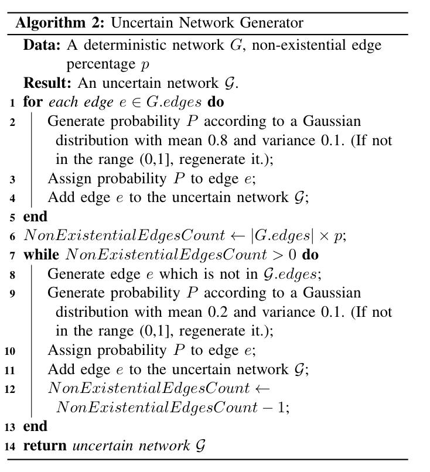

# Generate-uncertain-networks-from-certain-ones

Implementation of a generator that gets as an input a certain network and outputs an uncertain one. This algorithm was proposed by Chi Zhang and Osmar R. Zaïane in their paper titeled: ``Detecting local communities in networks with edge uncertainty".

Here is the pseudocode from the paper:

You can find an example in the jupyter nootebook, where the input graph was Zachary Karate Club and the output was an uncertain version of it.
